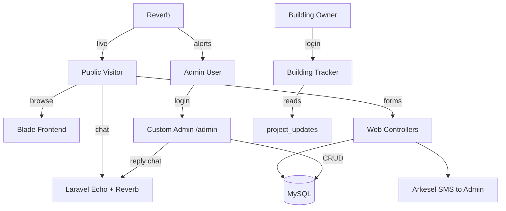
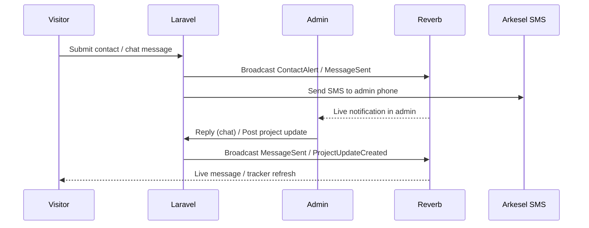

# JKD PINNacle — Construction Company Website & Admin System

## Overview
A full, robust, responsive construction-company website built on **Laravel 12** with a
custom (non-Filament) admin panel. All public content is fully manageable and reorderable
from the admin. Real-time chat, building-project tracking, and live meetings are powered by
**Laravel Reverb** (WebSockets) + **Jitsi Meet** embeds, with **Arkesel SMS** alerts to the
admin on every inbound contact.

## Tech Stack
- **Backend:** Laravel 12 (PHP 8.2+), MySQL
- **Frontend:** Blade + Tailwind CSS v4 + custom CSS + Alpine.js, built with Vite
- **Real-time:** Laravel Reverb (WebSockets), Laravel Echo (client)
- **Video meetings:** Jitsi Meet external embed
- **SMS alerts:** Arkesel (existing `App\Services\ArkeselSmsService`)
- **Auth:** Custom session auth (admin + client), no Filament, no Spatie

## Cleanup (first step)
- Remove Filament packages (`filament/filament`, `filament-shield`, `filament-spatie-roles-permissions`, `dotswan/filament-map-picker`, `joaopaulolndev/filament-pdf-viewer`, `flowframe/laravel-trend`)
- Delete `app/Filament`, `app/Providers/Filament`, electricity/fault/theft models, resources, widgets, migrations
- Keep `ArkeselSmsService`, `User` model, `routes/web.php` (reset)

## Data Model
| Table | Purpose |
|-------|---------|
| `users` (extend) | `+ phone, + role(admin/client), + avatar` |
| `settings` | key/value site config (name, logo, loading text, socials, SMS number, Jitsi domain, map embed) |
| `sliders` | home hero slides: video/image, title, subtitle, button, `sort_order`, `active` |
| `services` | title, slug, description, icon, image, `sort_order`, `active` |
| `projects` | title, slug, category, location, client, description, cover, gallery(JSON), lat, lng, status, featured, `sort_order` |
| `project_updates` | project_id, title, body, progress(0-100), image — building tracker feed |
| `team_members` | name, role, bio, photo, `sort_order`, `active` |
| `testimonials` | name, role, quote, avatar, `sort_order`, `active` |
| `quotes` | Get-a-quote / Request-a-touch submissions |
| `contacts` | Contact-page messages |
| `site_visits` | Scheduled site-visit requests |
| `meetings` | Live-meeting bookings (Jitsi room, scheduled_at) |
| `job_applications` | Role/artisan applications (trade, cv) |
| `conversations` | Chat threads (visitor <-> admin) |
| `messages` | conversation_id, sender_type, body, read_at |
| `client_project` | pivot: which projects a client can track |

## Architecture

## Real-time Flow

## Public Pages (routes)
- `/` Home — preloader, hero video slider + parallax, services, project-video boast, portfolio preview (6), scroll animations, CTA
- `/services` Services
- `/projects` Projects grid (filter by category/status)
- `/projects/{slug}` Project detail (gallery, map, details)
- `/about` About Us (team + editable story)
- `/quote` Get a quote / Request a touch
- `/contact` Contact — chat widget, call buttons, form, schedule site visit, book live meeting
- `/careers` Apply for role / artisan
- `/tracker` Building tracker (client login → projects → update timeline)

## Admin (`/admin`, auth)
Dashboard (stats) · Sliders (reorder) · Services (reorder) · Projects (gallery, map, featured) ·
Project Updates (progress) · Team · Testimonials · Quotes · Contacts · Site Visits ·
Meetings · Job Applications · Live Chat console · Settings (all site content & config)

## Build Phases (see todo list)
1. Cleanup + design system + base layout (nav/footer/preloader)
2. Migrations + models + factories
3. Auth (admin + client) + middleware
4. Reverb + broadcasting events + channels
5. Home page (all sections + animations)
6. Services / Projects list / Project detail
7. About / Careers
8. Quote / Contact (chat, call, visit, meeting)
9. Building Tracker
10. Admin shell + dashboard
11. Admin CRUD (content)
12. Admin CRUD (submissions + chat console)
13. Admin settings
14. SMS alerts wiring
15. Seeders, demo content, responsive/animation polish, flow testing
